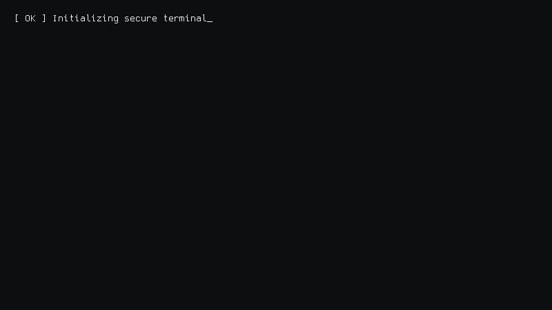

<!-- ================== TYPING HEADER (CYBER) ================== -->

  

 

---

## 🖥️ Terminal

  

---

## 🧠 About Me

I work in cybersecurity with a strong focus on **how systems actually behave** —  
not just how tools report issues.

**Approach**
- Internals before exploitation  
- Manual analysis before automation  
- Evidence-driven conclusions  

I enjoy breaking complex systems down to their **root causes**.

---

## 🎯 Areas of Focus

- Reverse Engineering & Binary Analysis  
- Malware Analysis (Linux / Windows)  
- Android Application Security  
- Bug Bounty (logic & access-control issues)  
- OSINT & intelligence tooling  

---

## 🌐 Connect With Me

  
  
  
  

---

## 🛠️ Skills & Tools

<b>Technical Stack</b>

 

### Security

### Tools

### Languages

### Platform

---

## 🧪 Platforms & Practice

  

---

## 🤝 Availability

Open to:
- Security research collaboration  
- CTF teams  
- Long-term learning projects  

---

## 📬 Contact

📧 **chavhanomkar702@gmail.com**

---

  Signal over noise. Depth over shortcuts.

<!-- Contribution Snake -->
<picture>
  <source media="(prefers-color-scheme: dark)" srcset="https://raw.githubusercontent.com/iknevo/iknevo/output/snake.svg">
  
</picture>

  

